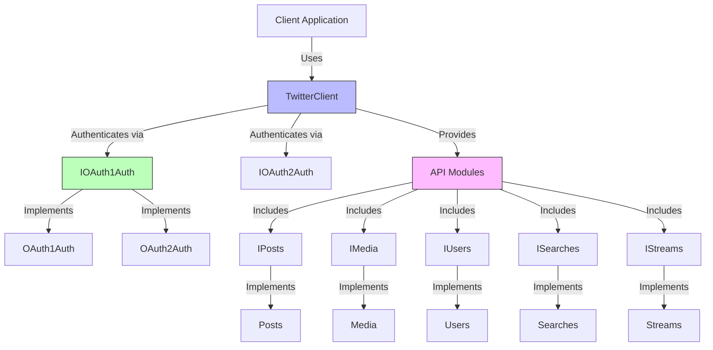
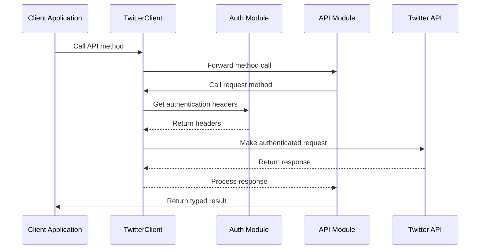

# Architecture for Twitter API SDK in TypeScript

## Status: Draft

## Technical Summary
This architecture defines a comprehensive TypeScript SDK for the Twitter API, providing developers with a robust, type-safe, and intuitive interface to interact with Twitter's v1.1 and v2 endpoints. The SDK follows a modular design pattern with clear interfaces, enabling easy customization and extension while ensuring thorough test coverage and adherence to open-source best practices.

## Technology Table

| Technology | Description |
|------------|-------------|
| TypeScript | Primary language for SDK development, providing type safety and modern JavaScript features |
| Node.js | Runtime environment for the SDK |
| Jest | Testing framework for unit and integration tests |
| Nock | HTTP mocking library for testing API interactions |
| Axios | HTTP client for making requests to the Twitter API |
| OAuth 1.0a | Authentication protocol for Twitter API v1.1 |
| OAuth 2.0 | Authentication protocol for Twitter API v2 |
| EventEmitter | For implementing streaming functionality |
| TypeDoc | For generating API documentation from JSDoc comments |
| GitHub Actions | For CI/CD workflows |

## Architectural Diagrams

### Core Components Relationship



### Request Flow



## Data Models

### Core Interfaces

```typescript
// ITwitterClient interface
export interface ITwitterClient {
  posts: IPosts;
  media: IMedia;
  users: IUsers;
  searches: ISearches;
  streams: IStreams;
}

// OAuth 1.0a interface
export interface IOAuth1Auth {
  setToken(token: IOAuth1Token): this;
  getAuthorizationHeaders(): IOAuth1AuthorizationHeaders;
  getAsAuthorizationHeader(): { Authorization: string };
}

// OAuth 2.0 interface
export interface IOAuth2Auth {
  // TBD
}


// API Module interface example (IPosts)
interface IPosts {
  createPost(text: string, options?: PostOptions): Promise<Post>;
  getPost(id: string): Promise<Post>;
  deletePost(id: string): Promise<void>;
  // Additional methods...
}
```

### Response Types

```typescript
// Post type
interface Post {
  id: string;
  text: string;
  created_at: string;
  author_id: string;
  // Additional properties...
}

// User type
interface User {
  id: string;
  name: string;
  username: string;
  // Additional properties...
}

// Media type
interface Media {
  media_id: string;
  type: 'photo' | 'video' | 'animated_gif';
  url?: string;
  // Additional properties...
}
```

## Project Structure

```
twitter-sdk/
├── src/
│   ├── auth/
│   │   ├── OAuth1Auth.ts           # OAuth 1.0a implementation
│   │   └── OAuth2Auth.ts           # OAuth 2.0 implementation
│   ├── api/
│   │   ├── posts.ts                # Posts API module
│   │   ├── media.ts                # Media API module
│   │   ├── users.ts                # Users API module
│   │   ├── searches.ts             # Searches API module
│   │   └── streams.ts              # Streaming API module
│   ├── interfaces
│   │   ├── ITwitterClient.ts       # Client interface
│   │   ├── api
│   │   │   ├── IMedia.ts           # Media module interface
│   │   │   ├── ISearches.ts        # Searches module interface
│   │   │   ├── IStreams.ts         # Streams module interface
│   │   │   ├── IPosts.ts           # Posts module interface
│   │   │   └── IUsers.ts           # Users module interface
│   │   └── auth
│   │       ├── IOAuth1Auth.ts      # OAuth 1.0a interface
│   │       └── IOAuth2Auth.ts      # OAuth 2.0 interface
│   ├── types/
│   │   ├── post.ts                 # Post type definitions
│   │   ├── user.ts                 # User type definitions
│   │   ├── media.ts                # Media type definitions
│   │   ├── search.ts               # Search type definitions
│   │   └── stream.ts               # Stream type definitions
│   ├── utils/
│   │   ├── request.ts              # HTTP request utilities
│   │   ├── rate-limit.ts           # Rate limiting utilities
│   │   └── error.ts                # Custom error classes
│   ├── client.ts                   # TwitterClient implementation
│   └── index.ts                    # Main entry point
├── tests/
│   ├── unit/
│   │   ├── auth/                   # Auth module tests
│   │   ├── api/                    # API module tests
│   │   └── client.test.ts          # Client tests
│   └── integration/
│       ├── posts.test.ts           # Posts integration tests
│       ├── media.test.ts           # Media integration tests
│       └── ...                     # Other integration tests
├── examples/
│   ├── basic-usage.ts              # Basic usage example
│   ├── media-upload.ts             # Media upload example
│   ├── streaming.ts                # Streaming example
│   └── ...                         # Other examples
├── docs/
│   ├── architecture.md             # This architecture document
│   └── ...                         # Other documentation
├── package.json                    # Package configuration
├── tsconfig.json                   # TypeScript configuration
├── jest.config.js                  # Jest configuration
├── .github/                        # GitHub configuration
│   └── workflows/                  # GitHub Actions workflows
├── LICENSE                         # License file
├── CONTRIBUTING.md                 # Contribution guidelines
├── CODE_OF_CONDUCT.md              # Code of conduct
└── README.md                       # Project overview
```

## Change Log

| Change | Story ID | Description |
|--------|----------|-------------|
| Initial Architecture | N/A | Initial draft of system design and documentation | 