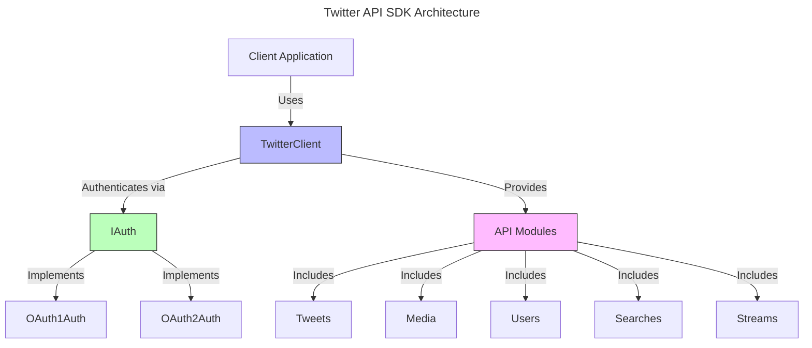

# Twitter API SDK in TypeScript

## Project Overview

### Purpose

The Twitter API SDK is a comprehensive, open-source Software Development Kit for the Twitter API using TypeScript. This SDK aims to fill the gaps in existing libraries by offering full support for Twitter API features, including media uploads with metadata, post usage metrics, and interactions such as likes and searches. It is designed to be modular, type-safe, and intuitive, adhering to best practices for open-source software development.

### Target Audience

- **Developers**: Individuals or teams building applications that interact with the Twitter API.
- **Open-Source Contributors**: Developers interested in extending, maintaining, or improving the SDK.

### Key Objectives

- Deliver a complete and current implementation of the Twitter API (both v1.1 and v2 endpoints).
- Ensure modularity to allow users to customize or extend components easily.
- Provide robust authentication support for OAuth 1.0a (v1.1) and OAuth 2.0 (v2).
- Include media upload functionality with metadata support, addressing a common limitation in existing libraries.
- Enable real-time streaming for tweets and other Twitter data.
- Achieve thorough testing coverage with unit and integration tests.
- Follow open-source best practices, including comprehensive documentation, appropriate licensing, and community engagement.

## Architecture

### Core Components

#### TwitterClient

- **Description**: The primary interface for interacting with the SDK, managing authentication and providing access to API modules (e.g., Tweets, Media).
- **Implementation Details**:
  - Implements the `ITwitterClient` interface.
  - Includes a `request` method to handle HTTP requests to the Twitter API.
  - Offers a factory method (`createClient`) for standard instantiation.
  - Supports dependency injection for custom implementations of authentication and API modules.

#### Authentication

- **Description**: Manages authentication for different Twitter API versions.
- **Implementation Details**:
  - Two classes: `OAuth1Auth` for v1.1 API and `OAuth2Auth` for v2 API.
  - Both implement the `IAuth` interface.
  - `TwitterClient` dynamically selects the appropriate authentication method based on the API endpoint.

### API Modules

- **Description**: Organized into classes representing Twitter API categories (e.g., Tweets, Media, Users, Searches).
- **Implementation Details**:
  - Each module (e.g., `Tweets`, `Media`) implements a corresponding interface (e.g., `ITweets`, `IMedia`).
  - Modules depend on the `ITwitterClient` interface for loose coupling, rather than the concrete `TwitterClient` class.

### Interfaces

- **Description**: Define contracts for SDK components to ensure flexibility and testability.
- **Implementation Details**:
  - `ITwitterClient`: Specifies the `request` method.
  - `IAuth`: Specifies the `getHeaders` method for authentication headers.
  - `ITweets`, `IMedia`, etc.: Specify methods specific to each API module (e.g., `postTweet`, `uploadMedia`).

### Factory Method

- **Description**: Simplifies instantiation of `TwitterClient` with default settings while allowing customization.
- **Implementation Details**:
  - `TwitterClient.createClient(config)`: A static method to create a client with default authentication and API modules.
  - Constructor supports passing custom implementations of `IAuth`, `ITweets`, etc.

### Supporting Features

- **Type Definitions**: Leverage TypeScript interfaces for type-safe API responses.
- **Rate Limiting**: Parse rate limit headers and throw a `RateLimitError` when limits are exceeded.
- **Streaming**: Implement event emitters to support real-time data from streaming endpoints.

## Architecture Diagram



## Code Structure

### Directory Layout 

```
x-sdk-ts/
├── src/
│ ├── auth/
│ │ ├── IAuth.ts
│ │ ├── OAuth1Auth.ts
│ │ └── OAuth2Auth.ts
│ ├── api/
│ │ ├── tweets.ts
│ │ ├── media.ts
│ │ ├── users.ts
│ │ ├── searches.ts
│ │ └── streams.ts
│ ├── interfaces/
│ │ ├── ITwitterClient.ts
│ │ ├── ITweets.ts
│ │ ├── IMedia.ts
│ │ └── ...
│ ├── types/
│ │ ├── tweet.ts
│ │ ├── user.ts
│ │ └── ...
│ ├── utils/
│ │ └── request.ts
│ └── index.ts
├── tests/
│ ├── unit/
│ └── integration/
├── examples/
│ └── basic-usage.ts
├── docs/
└── README.md
```

### Naming Conventions

- **Interfaces**: Prefixed with `I` (e.g., `ITwitterClient`, `IAuth`).
- **Classes**: Use descriptive names (e.g., `TwitterClient`, `OAuth1Auth`, `Tweets`).
- **Methods**: Use action-oriented names (e.g., `postTweet`, `uploadMedia`).

## Testing Strategy

### Unit Tests

- **Tools**: Jest for testing, Nock for mocking HTTP requests.
- **Approach**: Test API modules in isolation by mocking interfaces like `ITwitterClient`.

### Integration Tests

- **Approach**: Include optional tests using real API credentials (stored in a `.env` file) to validate end-to-end functionality.
- **Setup**: Skip integration tests if credentials are unavailable.

### Test Coverage

- Target high coverage for public methods, error handling, and edge cases (e.g., rate limits, invalid inputs).
- Use Jest coverage reports to monitor and improve coverage.

## Open-Source Considerations

### Documentation

- **Code Comments**: Use JSDoc for all public methods.
- **README**: Provide installation instructions, setup steps, and basic usage examples.
- **Examples**: Include runnable scripts in the `examples/` directory.
- **Auto-Generated Docs**: Use TypeDoc to create documentation from JSDoc comments.

### Licensing

- Adopt a permissive license (e.g., MIT or Apache 2.0).
- Include a `LICENSE` file in the repository.

### Versioning

- Adhere to semantic versioning (e.g., `1.0.0`).
- Maintain a `CHANGELOG.md` file to document updates.

### CI/CD

- Use GitHub Actions to:
  - Run tests on every push and pull request.
  - Publish the SDK to npm upon tagged releases.

### Community Engagement

- **CONTRIBUTING.md**: Detail the contribution process (e.g., fork, pull request workflow).
- **Issues/PRs**: Utilize GitHub for bug reports and feature requests.
- **Code of Conduct**: Adopt a standard code of conduct (e.g., Contributor Covenant).

## Development Phases

### Phase 1: Core SDK Development

- Implement authentication (`IAuth`, `OAuth1Auth`, `OAuth2Auth`).
- Build `TwitterClient` with factory method and request handling.
- Develop key API modules: `Tweets` and `Media` (including media uploads with metadata).

### Phase 2: Additional Features

- Add support for `Users`, `Searches`, and other API modules.
- Implement streaming functionality for real-time data.

### Phase 3: Testing and Documentation

- Write unit and integration tests for all components.
- Generate documentation and create practical usage examples.

### Phase 4: Open-Source Release

- Finalize licensing, versioning, and community guidelines.
- Publish the SDK to npm and promote it to the developer community.

## Success Criteria

- The SDK fully covers the Twitter API, including media uploads with metadata.
- Unit and integration tests achieve at least 80% coverage.
- The SDK is released as an open-source project with clear documentation and contribution guidelines.
- Early adopters and contributors provide positive feedback.

> 💡 **Tip:** This document serves as a high-level overview of the project. For detailed implementation guidelines, refer to the architecture document and code documentation.